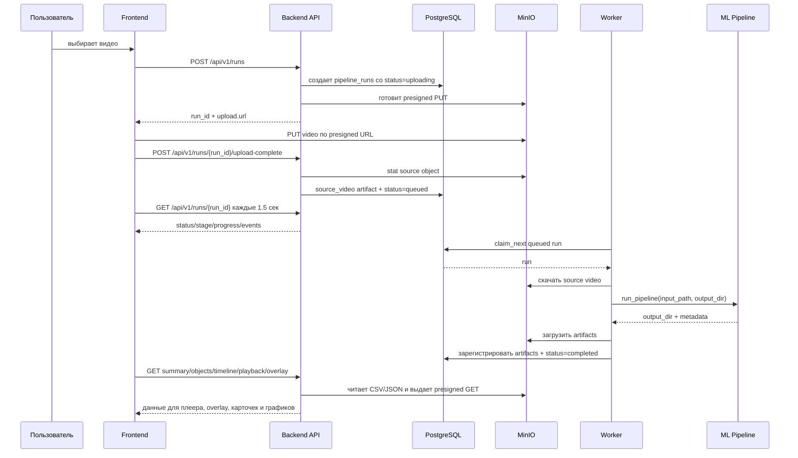

# Схема работы приложения: от загрузки видео до графиков

Документ описывает текущую реализацию: что делает фронт, что делает backend, где подключается worker, как запускается ML pipeline, какие файлы появляются в MinIO и откуда фронт берет данные для плеера, карточек и графиков.

Главная мысль: фронт не обрабатывает видео. Фронт только загружает файл, показывает статус и потом визуализирует готовые данные. Backend хранит состояние обработки, выдает ссылки на MinIO и отдает API для результата. Worker забирает задачу из БД, запускает ML pipeline, сохраняет артефакты обратно в MinIO и регистрирует их в БД.

## Быстрая карта проекта

| Часть | Что делает | Ключевые файлы |
|---|---|---|
| Frontend | Загружает видео, показывает архив, статус обработки, плеер, overlay, графики | [App.tsx](../apps/frontend/src/App.tsx), [api.ts](../apps/frontend/src/api.ts), [types.ts](../apps/frontend/src/types.ts), [RunCharts.tsx](../apps/frontend/src/components/RunCharts.tsx), [VideoOverlayPlayer.tsx](../apps/frontend/src/components/VideoOverlayPlayer.tsx) |
| Backend HTTP API | Создает обработку, выдает presigned URL, подтверждает загрузку, отдает статусы и результаты | [pipeline_runs.py](../apps/backend/src/presentation/http/routers/v1/pipeline_runs.py), [pipeline_run_service.py](../apps/backend/src/application/services/pipeline_run_service.py), [response.py](../apps/backend/src/presentation/http/dto/response.py) |
| Backend storage | Работает с MinIO: bucket, загрузка, скачивание, presigned GET/PUT | [minio_storage.py](../apps/backend/src/infrastructure/storage/minio_storage.py) |
| БД | Хранит run, события прогресса и зарегистрированные артефакты | [models.py](../apps/backend/src/infrastructure/database/models.py), [sql_pipeline_run_repository.py](../apps/backend/src/infrastructure/repositories/sql_pipeline_run_repository.py) |
| Worker | Забирает `queued` run из БД, скачивает видео из MinIO, запускает pipeline, загружает артефакты | [worker.py](../apps/backend/src/worker.py) |
| ML pipeline | Детекция, трекинг, классификация, агрегация, отчеты, overlay, видео с разметкой | [runner.py](../ml/pipeline/scripts/runner.py), [detection.py](../ml/pipeline/scripts/detection.py), [tracking.py](../ml/pipeline/scripts/tracking.py), [classification.py](../ml/pipeline/scripts/classification.py), [aggregation.py](../ml/pipeline/scripts/aggregation.py), [reporting/writer.py](../ml/pipeline/scripts/reporting/writer.py) |
| Dev запуск | Поднимает Postgres/MinIO/backend и локальный worker | [scripts/dev.sh](../scripts/dev.sh), [docker-compose.yml](../docker-compose.yml) |

## Как это выглядит целиком



## Как приложение запускается в dev-режиме

Текущий dev-режим описан в [scripts/dev.sh](../scripts/dev.sh).

Команда:

```bash
scripts/dev.sh
```

Что делает скрипт:

1. Проверяет, запущены ли Docker-сервисы `postgres` и `minio`.
2. Если они не запущены, запускает только недостающие сервисы через `docker compose up --detach`.
3. Ждет готовности PostgreSQL и MinIO.
4. Применяет миграции через сервис `migrate`.
5. Запускает backend в Docker, если он еще не запущен.
6. Запускает worker локально через `.venv/bin/python apps/backend/src/worker.py`.

Важно: frontend в этот сценарий не входит. Его нужно запускать отдельно из `apps/frontend`.

Текущее распределение по окружениям:

| Компонент | Где работает | Почему так |
|---|---|---|
| PostgreSQL | Docker | Удобно поднимать одинаковую БД на разных ПК |
| MinIO | Docker | Удобно иметь локальный S3-compatible storage |
| Backend API | Docker | Удобный стабильный API на `localhost:8000` |
| Worker | Локально | ML-модели и обработка видео остаются на машине, без тяжелой сборки Docker-образа |
| Frontend | Локально | Vite dev server, быстрый hot reload |

Конфигурация Docker находится в [docker-compose.yml](../docker-compose.yml). Общий шаблон backend-сервисов вынесен в `x-backend-service`, чтобы `backend` и `migrate` использовали один образ, env и volume-настройки.

## Главные сущности

### Run

`run` — это одна независимая обработка одного видео.

Run создается сразу, до фактической загрузки файла в MinIO. Это нужно, чтобы:

- получить стабильный `run_id`;
- заранее построить путь в MinIO;
- записать состояние в БД;
- дать фронту URL для загрузки файла.

Модель run находится в [PipelineRun](../apps/backend/src/infrastructure/database/models.py#L25).

Ключевые поля:

| Поле | Для чего |
|---|---|
| `pipeline_runs_id` | ID обработки. На фронте отдается как `run_id` |
| `source_name` | Оригинальное имя файла после безопасной нормализации |
| `source_object_key` | Путь исходного видео в MinIO |
| `source_content_type` | MIME type исходного файла |
| `source_size_bytes` | Размер исходного файла |
| `status` | Общий статус: `uploading`, `queued`, `processing`, `completed`, `processing_failed` |
| `stage` | Текущий этап внутри обработки: `upload`, `queued`, `preparing`, `detection`, `tracking`, `classification`, `aggregation`, `rendering`, `uploading_artifacts`, `completed`, `failed` |
| `progress` | Число от 0 до 100 для progress bar |
| `status_message` | Человекочитаемый текст для фронта |
| `fps`, `frame_count`, `duration_sec`, `width`, `height` | Метаданные видео после успешной обработки |
| `created_at`, `upload_completed_at`, `started_at`, `completed_at`, `updated_at` | Временные точки жизненного цикла |

### Artifact

`artifact` — это зарегистрированный файл результата в MinIO.

Модель находится в [PipelineArtifact](../apps/backend/src/infrastructure/database/models.py#L157).

Примеры типов:

| `artifact_type` | Файл | Для чего |
|---|---|---|
| `source_video` | исходное видео | Плеер показывает именно его |
| `overlay` | `overlay.json` | Координаты bbox и карточек поверх видео |
| `detections` | `detections.csv` | Детекции по кадрам, источник timeline-графиков |
| `tracks` | `tracks.csv` | Объекты/треки, источник карточек лучших объектов |
| `brand_summary` | `brand_summary_by_tracks.csv` | Сводка по брендам, источник основных графиков |
| `detection_summary` | `brand_summary_by_detections.csv` | Сводка по детекциям |
| `frame_summary` | `frame_summary.csv` | Сводка по кадрам |
| `report` | `report.html` | HTML-отчет pipeline |
| `viewer` | `viewer.html` | Локальный HTML-viewer pipeline |
| `annotated_video` | `annotated_video.mp4` | Видео с уже нарисованной разметкой, если создано pipeline |

Файлы `crops/...` тоже загружаются в MinIO, но не регистрируются отдельными строками в таблице `pipeline_artifacts`. Это сделано специально, чтобы один прогон видео не создавал сотни или тысячи строк в таблице только из-за crop-картинок. Ссылки на crop строятся backend-ом по `best_crop_path` из `tracks.csv`.

Логика регистрации artifact-ов находится в [worker.py](../apps/backend/src/worker.py#L39) и [worker.py](../apps/backend/src/worker.py#L169).

### Event

`event` — это запись истории прогресса.

Модель находится в [PipelineRunEvent](../apps/backend/src/infrastructure/database/models.py#L203).

События нужны для истории этапов обработки. Они не являются основным источником результата, но помогают понимать, где run находился по времени.

События записывает repository:

- при создании run;
- при завершении upload;
- при claim задачи worker-ом;
- при значимых изменениях stage/progress;
- при completed/failed.

Логика — [sql_pipeline_run_repository.py](../apps/backend/src/infrastructure/repositories/sql_pipeline_run_repository.py).

## Шаг 1. Фронт показывает экран загрузки

Экран загрузки находится в [UploadPage](../apps/frontend/src/App.tsx#L225).

Пользователь выбирает файл через `<input type="file">` или drag-and-drop. Фронт хранит выбранный файл в локальном React state:

- `file`;
- `progress`;
- `busy`;
- `error`.

На этом этапе файл еще нигде не сохранен. Он лежит только в браузере.

Когда пользователь нажимает “Начать анализ”, вызывается `startUpload()` в [App.tsx](../apps/frontend/src/App.tsx#L242).

Последовательность на фронте:

```ts
const run = await createRun(file)
await uploadVideo(run.upload, file, setProgress)
await completeUpload(run.run_id)
navigate(`/runs/${run.run_id}`)
```

Эти функции описаны в [api.ts](../apps/frontend/src/api.ts).

## Шаг 2. Фронт создает run через backend

Фронт вызывает:

```http
POST /api/v1/runs
```

Код фронта: [createRun](../apps/frontend/src/api.ts#L38).

Тело запроса:

```json
{
  "file_name": "VideoProject.mp4",
  "content_type": "video/mp4",
  "size_bytes": 1144675940
}
```

Backend endpoint находится в [pipeline_runs.py](../apps/backend/src/presentation/http/routers/v1/pipeline_runs.py#L27).

Endpoint вызывает `PipelineRunService.create_run()` в [pipeline_run_service.py](../apps/backend/src/application/services/pipeline_run_service.py#L50).

Что делает service:

1. Нормализует имя файла через `safe_file_name()`.
2. Проверяет расширение: разрешены `.avi`, `.m4v`, `.mkv`, `.mov`, `.mp4`, `.webm`.
3. Проверяет, что размер больше нуля.
4. Генерирует `run_id`.
5. Собирает путь исходного файла в MinIO:

```text
runs/{run_id}/source/{safe_file_name}
```

6. Создает запись в БД через repository.
7. Создает presigned PUT URL для загрузки видео.
8. Возвращает фронту `run_id`, `status` и `upload`.

Ответ backend:

```json
{
  "data": {
    "run_id": "...",
    "status": "uploading",
    "upload": {
      "method": "PUT",
      "url": "http://127.0.0.1:9000/...",
      "headers": {
        "Content-Type": "video/mp4"
      }
    }
  }
}
```

DTO ответа описан в [CreateRunResponse](../apps/backend/src/presentation/http/dto/response.py#L35).

## Шаг 3. Backend создает запись в БД

Создание записи делает [SqlPipelineRunRepository.create](../apps/backend/src/infrastructure/repositories/sql_pipeline_run_repository.py#L20).

Новый run получает:

```text
status = uploading
stage = upload
progress = 0
status_message = "Ждём загрузку видео"
```

Параллельно создается первое событие:

```text
stage = upload
progress = 0
message = "Обработка создана"
```

На этом этапе в MinIO еще нет файла. В БД есть только намерение принять файл.

## Шаг 4. Фронт загружает видео напрямую в MinIO

Фронт получает `upload.url` от backend и делает прямой `PUT` в MinIO.

Код загрузки: [uploadVideo](../apps/frontend/src/api.ts#L49).

Загрузка сделана через `XMLHttpRequest`, потому что у него есть простой progress callback:

```ts
request.upload.onprogress = (event) => {
  if (event.lengthComputable) {
    onProgress(Math.round((event.loaded / event.total) * 100))
  }
}
```

Проценты на экране загрузки — это именно прогресс передачи файла из браузера в MinIO. Это еще не прогресс ML-обработки.

Важно: это не resumable upload. Если закрыть вкладку или обновить страницу во время передачи файла, загрузка может оборваться. Если файл уже загружен и backend получил `upload-complete`, дальнейшая обработка продолжит жить независимо от страницы.

## Шаг 5. Фронт подтверждает завершение загрузки

После успешного `PUT` в MinIO фронт вызывает:

```http
POST /api/v1/runs/{run_id}/upload-complete
```

Код фронта: [completeUpload](../apps/frontend/src/api.ts#L79).

Backend endpoint: [pipeline_runs.py](../apps/backend/src/presentation/http/routers/v1/pipeline_runs.py#L40).

Service: [PipelineRunService.complete_upload](../apps/backend/src/application/services/pipeline_run_service.py#L87).

Что делает backend:

1. Загружает run из БД.
2. Проверяет, что статус сейчас `uploading` или `upload_failed`.
3. Делает `stat` объекта в MinIO по `source_object_key`.
4. Регистрирует artifact:

```text
artifact_type = source_video
object_key = runs/{run_id}/source/{file_name}
```

5. Меняет run:

```text
status = queued
stage = queued
progress = 0
status_message = "Видео загружено. Анализ скоро начнётся"
upload_completed_at = now()
```

6. Пишет event `queued`.

После этого видео считается готовым к обработке. Worker сможет его забрать.

## Шаг 6. Фронт переходит на страницу run и начинает polling

После `upload-complete` фронт делает:

```ts
navigate(`/runs/${run.run_id}`)
```

Страница конкретного run находится в [RunPage](../apps/frontend/src/App.tsx#L342).

Пока статус не финальный, фронт раз в 1.5 секунды вызывает:

```http
GET /api/v1/runs/{run_id}
```

Код polling-а: [App.tsx](../apps/frontend/src/App.tsx#L346).

Финальные статусы:

```ts
completed
processing_failed
```

Если статус не финальный, показывается [ProcessingPage](../apps/frontend/src/App.tsx#L374). Он берет из run:

- `status`;
- `stage`;
- `progress`;
- `status_message`;
- `events`.

Важное следствие: если открыть другое видео, потом вернуться к текущему run, прогресс не потеряется. Фронт просто заново запросит состояние из backend, а backend прочитает его из PostgreSQL.

Это называется:

- async background job;
- persistent job state;
- polling.

WebSocket сейчас не используется.

## Шаг 7. Worker забирает задачу из очереди

Worker запускается из [worker.py](../apps/backend/src/worker.py).

В dev-режиме его стартует [scripts/dev.sh](../scripts/dev.sh#L110).

Основной цикл:

```py
while True:
    processed = self.process_next()
    if not processed:
        time.sleep(worker_poll_interval_sec)
```

Код: [PipelineWorker.run_forever](../apps/backend/src/worker.py#L100).

Worker не получает задачу через HTTP. Он сам ходит в PostgreSQL и ищет run со статусом `queued`.

Захват задачи делает [SqlPipelineRunRepository.claim_next](../apps/backend/src/infrastructure/repositories/sql_pipeline_run_repository.py#L158).

Запрос:

```py
select(PipelineRun)
    .where(PipelineRun.status == "queued")
    .order_by(PipelineRun.created_at)
    .with_for_update(skip_locked=True)
    .limit(1)
```

Зачем `with_for_update(skip_locked=True)`:

- если когда-нибудь будет несколько worker-ов, они не возьмут один и тот же run;
- один worker залочит строку;
- другой worker пропустит залоченную строку и возьмет следующую.

После claim run получает:

```text
status = processing
stage = preparing
progress = 1
status_message = "Готовим видео к анализу"
worker_id = hostname:pid
started_at = now()
```

## Шаг 8. Worker скачивает видео из MinIO во временную папку проекта

Внутри [PipelineWorker.process_next](../apps/backend/src/worker.py#L108) собираются локальные пути:

```text
.runtime/worker/{run_id}/input/{source_name}
.runtime/worker/{run_id}/output
```

`worker_temp_dir` задается в settings и по умолчанию равен:

```text
{project_root}/.runtime/worker
```

Код settings: [PipelineSettings](../apps/backend/src/settings/app.py#L53).

Worker скачивает исходное видео:

```py
self._storage.download_file(run.source_object_key, input_path)
```

Метод MinIO: [download_file](../apps/backend/src/infrastructure/storage/minio_storage.py#L62).

После завершения обработки worker удаляет локальную временную папку:

```py
shutil.rmtree(run_root)
```

То есть постоянное хранение находится не в `.runtime`, а в MinIO и PostgreSQL.

## Шаг 9. Worker создает PipelineConfig

Перед запуском pipeline worker собирает [PipelineConfig](../ml/pipeline/scripts/config.py#L67):

```py
PipelineConfig(
    input_path=input_path,
    output_dir=output_path,
    detector_model_path=...,
    classifier_model_path=...,
    brand_overrides_path=...,
    run_id=run.pipeline_runs_id,
    frame_stride=...,
    device=...,
)
```

Код: [worker.py](../apps/backend/src/worker.py#L134).

Основные параметры:

| Параметр | Для чего |
|---|---|
| `input_path` | Локальная копия видео |
| `output_dir` | Папка, куда pipeline пишет результаты |
| `detector_model_path` | YOLO/детектор рекламных объектов |
| `classifier_model_path` | Модель классификации брендов |
| `brand_overrides_path` | CSV ручных переопределений брендов |
| `run_id` | ID обработки, попадает в CSV |
| `frame_stride` | Шаг обработки кадров |
| `device` | CPU/GPU устройство |

Модели загружаются один раз и переиспользуются между run-ами:

```py
if self._models is None:
    self._models = load_pipeline_models(...)
```

Это важно для скорости: worker не должен заново грузить тяжелые модели на каждое видео.

## Шаг 10. Pipeline выполняет ML-обработку

Точка входа pipeline: [run_pipeline](../ml/pipeline/scripts/runner.py#L76).

Основные стадии:

| Stage | Progress | Что происходит | Код |
|---|---:|---|---|
| `preparing` | 1 | Подготовка видео и моделей | [run_pipeline](../ml/pipeline/scripts/runner.py#L83) |
| `detection` | 2–65 | Чтение кадров, детекция рекламных объектов, сохранение crop-ов, оценка качества crop | [run_detection_stage](../ml/pipeline/scripts/runner.py#L123), [run_video_detection_stream](../ml/pipeline/scripts/runner.py#L290) |
| `tracking` | 66 | Связь детекций в треки и объекты | [run_tracking_stage](../ml/pipeline/scripts/runner.py#L166) |
| `classification` | 71 | Классификация бренда по лучшим crop-ам | [run_classification_stage](../ml/pipeline/scripts/runner.py#L176) |
| `aggregation` | 83 | Сбор итоговых метрик по трекам/объектам | [run_final_aggregation_stage](../ml/pipeline/scripts/runner.py#L204) |
| business rules | после aggregation | Ручные override-ы и стабилизация бренда объекта | [run_business_rules_stage](../ml/pipeline/scripts/runner.py#L209) |
| `rendering` | 88 | Генерация видео/overlay/viewer/report/CSV/charts | [write_artifacts_stage](../ml/pipeline/scripts/runner.py#L263) |
| `uploading_artifacts` | 96 | Pipeline закончил локальные файлы, worker готовит upload в MinIO | [run_pipeline](../ml/pipeline/scripts/runner.py#L104) |

### Детекция

Для видео используется потоковая обработка кадров: [run_video_detection_stream](../ml/pipeline/scripts/runner.py#L290).

Pipeline читает кадры через `iter_frames`, прогоняет детектор, сохраняет crop-ы и считает качество crop-а.

Прогресс detection считается по количеству обработанных sampled frames:

```py
detection_progress = 2 + round(
    63 * min(1.0, processed_frames / sampled_frame_count)
)
```

То есть detection занимает диапазон progress примерно от 2 до 65.

### Visibility score

Метрика заметности считается в [visibility.py](../ml/pipeline/scripts/visibility.py).

Ключевая идея:

```text
video_visibility_score = area_score * position_weight
video_visibility_weighted_seconds = video_visibility_score * frame.delta_t_sec
```

Грубо:

- чем больше объект в кадре, тем выше `area_score`;
- чем ближе к центру кадра, тем выше `position_weight`;
- итоговая заметность учитывает время присутствия.

Эти поля попадают в `detections.csv` и `tracks.csv`.

### Tracking и object_id

Tracking связывает отдельные bbox на кадрах в треки. Потом треки объединяются в бизнес-объекты.

Ключевые функции:

- [assign_track_ids](../ml/pipeline/scripts/tracking.py);
- [build_tracks](../ml/pipeline/scripts/aggregation.py#L22);
- [assign_object_groups](../ml/pipeline/scripts/track_groups.py);

На выходе появляется `tracks.csv`. Фронт использует его для карточек “самых заметных объектов”.

### Classification

Классификация бренда работает не по каждому bbox как итоговому объекту, а по crop-ам, которые прошли фильтры качества.

Ключевой код:

- [classification.py](../ml/pipeline/scripts/classification.py);
- [run_classification_stage](../ml/pipeline/scripts/runner.py#L176).

Поля результата:

- `brand_pred`;
- `brand_conf`;
- `final_brand`;
- `final_brand_conf`;
- `business_brand`;
- `business_visible`.

### Aggregation

Агрегация собирает детекции в треки и считает итоговые поля уровня объекта.

Код: [aggregation.py](../ml/pipeline/scripts/aggregation.py).

Важные поля `TrackRecord` описаны в [schemas.py](../ml/pipeline/scripts/schemas.py#L88):

| Поле | Для чего |
|---|---|
| `object_id` | ID бизнес-объекта |
| `track_id` | ID трека |
| `first_timestamp_sec`, `last_timestamp_sec` | Когда объект виден |
| `visible_duration_sec` | Длительность видимости |
| `detections_count` | Сколько bbox вошло в объект/трек |
| `best_crop_path` | Локальный путь лучшего crop-а |
| `best_timestamp_sec` | Лучший момент для перехода в плеере |
| `final_brand_conf` | Уверенность бренда |
| `video_visibility_weighted_seconds` | Итоговый вклад объекта в заметность |
| `business_brand` | Бренд для бизнес-отчета |
| `business_visible` | Попал ли объект в бизнес-видимый результат |

## Шаг 11. Pipeline пишет локальные артефакты

Функция [write_artifacts_stage](../ml/pipeline/scripts/runner.py#L263) вызывает:

1. `copy_crops_by_status(...)`;
2. `write_annotated_media(...)`;
3. `write_html_overlay_viewer(...)`;
4. `write_pipeline_outputs(...)`.

Главная функция записи отчетов: [write_pipeline_outputs](../ml/pipeline/scripts/reporting/writer.py#L15).

Она создает:

```text
input_meta.json
detections.csv
tracks.csv
brand_summary_by_detections.csv
brand_summary_by_tracks.csv
frame_summary.csv
report.html
charts/*.png
```

Отдельно viewer-часть создает:

```text
viewer.html
overlay.json
```

`overlay.json` нужен фронтовому плееру. Он содержит:

- размеры видео;
- fps;
- frame_count;
- frame_stride;
- массив кадров;
- для каждого кадра — объекты, bbox, brand, confidence, score и цвет.

Фронтовый тип описан в [OverlayPayload](../apps/frontend/src/types.ts#L82).

## Шаг 12. Worker загружает артефакты в MinIO

После завершения pipeline worker вызывает `_upload_artifacts()`: [worker.py](../apps/backend/src/worker.py#L169).

Для каждого файла из `output_dir` строится object key:

```text
runs/{run_id}/artifacts/{relative_path}
```

Примеры:

```text
runs/{run_id}/artifacts/overlay.json
runs/{run_id}/artifacts/detections.csv
runs/{run_id}/artifacts/tracks.csv
runs/{run_id}/artifacts/brand_summary_by_tracks.csv
runs/{run_id}/artifacts/crops/passed/...
```

Каждый файл загружается в MinIO через [MinioStorage.upload_file](../apps/backend/src/infrastructure/storage/minio_storage.py#L70).

Потом worker регистрирует artifact в PostgreSQL через [repository.add_artifact](../apps/backend/src/infrastructure/repositories/sql_pipeline_run_repository.py#L118), но только если `should_register_artifact(relative)` вернул `True`.

Сейчас crop-файлы не регистрируются:

```py
def should_register_artifact(relative_path: Path) -> bool:
    return relative_path.parts[:1] != ("crops",)
```

Код: [worker.py](../apps/backend/src/worker.py#L57).

После успешной загрузки всех artifact-ов worker вызывает [mark_completed](../apps/backend/src/infrastructure/repositories/sql_pipeline_run_repository.py#L211).

Run получает:

```text
status = completed
stage = completed
progress = 100
status_message = "Анализ готов"
fps = result.metadata.fps
frame_count = result.metadata.frame_count
frame_stride = result.metadata.frame_stride
duration_sec = frame_count / fps
width = result.metadata.width
height = result.metadata.height
completed_at = now()
```

## Шаг 13. Фронт видит `completed` и загружает результат

Когда [RunPage](../apps/frontend/src/App.tsx#L342) получает run со статусом `completed`, он рендерит [ResultPage](../apps/frontend/src/App.tsx#L423).

`ResultPage` параллельно вызывает пять endpoints:

```ts
Promise.all([
  getRunSummary(run.run_id),
  getRunObjects(run.run_id),
  getRunTimeline(run.run_id),
  getRunPlayback(run.run_id),
  getRunOverlay(run.run_id),
])
```

Код: [App.tsx](../apps/frontend/src/App.tsx#L433).

Функции API находятся в [api.ts](../apps/frontend/src/api.ts#L89).

## Backend endpoints результата

Все endpoints находятся в [pipeline_runs.py](../apps/backend/src/presentation/http/routers/v1/pipeline_runs.py).

| Endpoint | Что возвращает | Чем питается |
|---|---|---|
| `GET /api/v1/runs/{run_id}` | статус, прогресс, events, artifacts, метаданные видео | PostgreSQL |
| `GET /api/v1/runs/{run_id}/summary` | totals + бренды | `brand_summary_by_tracks.csv` из MinIO |
| `GET /api/v1/runs/{run_id}/objects?limit=100` | лучшие объекты/треки + crop_url | `tracks.csv` из MinIO + crop paths |
| `GET /api/v1/runs/{run_id}/timeline?bucket_seconds=5` | точки timeline | `detections.csv` из MinIO |
| `GET /api/v1/runs/{run_id}/playback` | ссылки на видео | `source_video` и `annotated_video` artifacts |
| `GET /api/v1/runs/{run_id}/overlay` | JSON overlay для bbox и карточек | `overlay.json` из MinIO |
| `GET /api/v1/runs/{run_id}/artifacts/{artifact_id}/url` | presigned URL конкретного artifact | `pipeline_artifacts` + MinIO |

## Как backend читает CSV и JSON из MinIO

Service находится в [pipeline_run_service.py](../apps/backend/src/application/services/pipeline_run_service.py).

### Summary

Метод: [get_summary](../apps/backend/src/application/services/pipeline_run_service.py#L145).

Backend ищет artifact:

```text
artifact_type = brand_summary
```

Это файл:

```text
brand_summary_by_tracks.csv
```

Дальше backend читает CSV из MinIO:

```py
dataframe = self._read_csv(artifact)
```

И считает totals:

```py
total_objects = sum(object_count)
total_visibility = sum(video_visibility_weighted_seconds)
```

Ответ идет во фронтовый тип [RunSummary](../apps/frontend/src/types.ts#L47).

### Objects

Метод: [get_objects](../apps/backend/src/application/services/pipeline_run_service.py#L173).

Backend ищет artifact:

```text
artifact_type = tracks
```

Это файл:

```text
tracks.csv
```

Логика:

1. Читает `tracks.csv`.
2. Если есть `business_visible`, оставляет только видимые объекты.
3. Сортирует по `video_visibility_weighted_seconds` по убыванию.
4. Ограничивает `limit`.
5. Для каждого объекта берет `best_crop_path`.
6. Превращает локальный crop path в MinIO object key через `crop_object_key()`.
7. Генерирует `crop_url` через presigned GET.

Ответ идет во фронтовый тип [RunObjects](../apps/frontend/src/types.ts#L67).

### Timeline

Метод: [get_timeline](../apps/backend/src/application/services/pipeline_run_service.py#L212).

Backend ищет artifact:

```text
artifact_type = detections
```

Это файл:

```text
detections.csv
```

Логика:

1. Читает `detections.csv`.
2. Если есть `business_visible`, оставляет только видимые детекции.
3. Считает bucket:

```py
bucket_start_sec = timestamp_sec // bucket_seconds * bucket_seconds
```

4. Группирует по:

```text
bucket_start_sec
business_brand
```

5. Считает:

```text
detection_count = count(det_index)
visibility_score = sum(video_visibility_score)
```

Ответ идет во фронтовый тип [RunTimeline](../apps/frontend/src/types.ts#L76).

### Playback

Метод: [get_playback](../apps/backend/src/application/services/pipeline_run_service.py#L128).

Backend ищет artifact-ы:

```text
source_video
annotated_video
```

И возвращает:

```json
{
  "source_url": "...",
  "annotated_url": "..."
}
```

Сейчас фронтовый плеер использует `source_url`, а bbox/card overlay рисует сам поверх исходного видео.

### Overlay

Метод: [get_overlay](../apps/backend/src/application/services/pipeline_run_service.py#L141).

Backend ищет:

```text
artifact_type = overlay
```

Читает `overlay.json` из MinIO и возвращает его как JSON.

## MinIO: internal и public endpoint

MinIO storage описан в [minio_storage.py](../apps/backend/src/infrastructure/storage/minio_storage.py).

Там создаются два клиента:

```py
self._internal = Minio(settings.internal_endpoint, ...)
self._public = Minio(settings.public_endpoint, ...)
```

Зачем два endpoint-а:

| Endpoint | Кто использует | Пример |
|---|---|---|
| internal | backend/worker внутри Docker-сети или локального процесса | `http://minio:9000` |
| public | браузер пользователя | `http://127.0.0.1:9000` |

Backend/worker могут ходить в MinIO по внутреннему имени контейнера, но браузер не знает hostname `minio`. Поэтому ссылки, которые уходят во фронт, должны строиться через public endpoint.

Методы:

| Метод | Клиент | Для чего |
|---|---|---|
| `presigned_put` | public | Дать браузеру URL для загрузки видео |
| `presigned_get` | public | Дать браузеру URL для видео/crop/artifact |
| `stat` | internal | Проверить, что объект реально есть |
| `download_file` | internal | Worker скачивает исходное видео |
| `upload_file` | internal | Worker загружает результаты |
| `read_bytes/read_text` | internal | Backend читает CSV/JSON |

Конфиг endpoint-ов собирается в [settings/app.py](../apps/backend/src/settings/app.py#L126).

В Docker Compose для backend сейчас явно задается:

```yaml
MINIO_INTERNAL_ENDPOINT: http://minio:9000
MINIO_PUBLIC_ENDPOINT: http://127.0.0.1:9000
```

Код: [docker-compose.yml](../docker-compose.yml#L10).

## Как работает фронтовая страница результата

Основной компонент: [ResultPage](../apps/frontend/src/App.tsx#L423).

Он показывает:

1. Header и основные метрики.
2. Плеер с overlay.
3. Графики.
4. Карточки лучших объектов.

### Header и верхние метрики

Данные:

- `run.source_name`;
- `run.duration_sec`;
- `run.width`;
- `run.height`;
- `summary.totals.total_objects`;
- `summary.totals.visibility_index`;
- `run.fps`;
- `run.frame_count`.

Код: [App.tsx](../apps/frontend/src/App.tsx#L472).

Источник:

- run — `GET /api/v1/runs/{run_id}`;
- summary — `GET /api/v1/runs/{run_id}/summary`.

### Плеер и overlay

Компонент: [VideoOverlayPlayer](../apps/frontend/src/components/VideoOverlayPlayer.tsx#L68).

Он получает:

```tsx
<VideoOverlayPlayer
  sourceUrl={playback.source_url}
  overlay={overlay}
  seekRequest={seek}
/>
```

Источник:

- `sourceUrl` приходит из `GET /playback`;
- `overlay` приходит из `GET /overlay`.

Плеер показывает исходное видео, а bbox и карточки рисуются HTML/CSS/SVG поверх видео.

Как синхронизируется overlay:

1. Компонент строит `frameMap`: `frame_index -> objects`.
2. Следит за текущим временем видео.
3. Переводит время в кадр:

```ts
const nextFrame = Math.round(mediaTime * fps)
```

4. Берет объекты для текущего кадра.
5. Масштабирует bbox из координат исходного видео в размер реального `<video>` на странице.
6. Рисует:

- прямоугольники bbox;
- карточки с метриками;
- SVG-линии от bbox к карточке.

Важная деталь: overlay считается не на весь DOM-элемент video, а на фактическую область изображения внутри него. Это нужно, чтобы при `object-fit: contain` bbox не уезжали в черные поля, когда размер окна меняется. Код расчета: [getVideoContentRect](../apps/frontend/src/components/VideoOverlayPlayer.tsx#L253).

### Карточки лучших объектов

Карточки находятся в [ResultPage](../apps/frontend/src/App.tsx#L530).

Источник:

```http
GET /api/v1/runs/{run_id}/objects?limit=100
```

Backend берет `tracks.csv`, сортирует объекты по `video_visibility_weighted_seconds`, добавляет `crop_url`.

Фронт показывает первые 12:

```ts
const topObjects = objects?.objects.slice(0, 12) ?? []
```

При клике на карточку:

```ts
setSeek(object.best_timestamp_sec)
```

Это передается в `VideoOverlayPlayer`, и видео перематывается к лучшему моменту объекта.

## Как работают графики

Компонент графиков: [RunCharts](../apps/frontend/src/components/RunCharts.tsx).

Библиотека графиков: `recharts`.

Компонент получает:

```tsx
<RunCharts
  brands={summary.brands}
  objects={objects?.objects ?? []}
  timeline={timeline}
  onSeek={setSeek}
/>
```

Источник данных:

| Prop | Backend endpoint | Файл в MinIO |
|---|---|---|
| `brands` | `GET /summary` | `brand_summary_by_tracks.csv` |
| `objects` | `GET /objects` | `tracks.csv` |
| `timeline` | `GET /timeline` | `detections.csv` |

### Фильтр брендов

Вверху графиков есть локальный фильтр брендов.

Код: [RunCharts.tsx](../apps/frontend/src/components/RunCharts.tsx#L54).

Состояние:

```ts
const [hiddenBrands, setHiddenBrands] = useState<Set<string>>(new Set())
```

Это чисто фронтовая фильтрация. Backend повторно не вызывается. Если отключить `OTHER`, компонент просто убирает `other` из массивов перед отрисовкой.

### График “Объекты по брендам”

Код: [RunCharts.tsx](../apps/frontend/src/components/RunCharts.tsx#L135).

Данные:

```text
summary.brands[].object_count
```

Источник в pipeline:

```text
brand_summary_by_tracks.csv
```

Поле считается в [write_summaries](../ml/pipeline/scripts/reporting/summaries.py#L57): сначала объекты группируются по `object_id` и `business_brand`, потом считается количество объектов по бренду.

### График “Индекс заметности”

Код: [RunCharts.tsx](../apps/frontend/src/components/RunCharts.tsx#L171).

Данные:

```text
summary.brands[].video_visibility_weighted_seconds
```

Это суммарная заметность бренда по всем видимым объектам.

Считается в pipeline из `video_visibility_score * delta_t_sec`.

### График “Доля заметности”

Код: [RunCharts.tsx](../apps/frontend/src/components/RunCharts.tsx#L207).

Данные те же, что у “Индекса заметности”, но форма другая:

```text
brand -> visibility_index
```

Фронт рисует pie chart.

### График “Количество и заметность”

Код: [RunCharts.tsx](../apps/frontend/src/components/RunCharts.tsx#L232).

Данные:

- `object_count`;
- `visibility_index`.

Это комбинированный график:

- bar — количество объектов;
- line — индекс заметности.

Смысл: можно быстро увидеть ситуацию, когда объектов мало, но они заметные, или объектов много, но вклад слабый.

### График “Уверенность по брендам”

Код: [RunCharts.tsx](../apps/frontend/src/components/RunCharts.tsx#L278).

Данные:

```text
summary.brands[].mean_final_brand_conf * 100
```

Источник:

```text
brand_summary_by_tracks.csv
```

Поле считается в [write_summaries](../ml/pipeline/scripts/reporting/summaries.py#L57) из `final_brand_conf`.

### График “Самые заметные объекты”

Код: [RunCharts.tsx](../apps/frontend/src/components/RunCharts.tsx#L315).

Данные:

```text
objects[].video_visibility_weighted_seconds
objects[].best_timestamp_sec
objects[].business_brand
```

Источник:

```text
tracks.csv
```

Фронт сортирует объекты по `video_visibility_weighted_seconds` и берет top 10.

При клике на строку графика фронт вызывает:

```ts
onSeek(best_timestamp_sec)
```

Видео перематывается к лучшему моменту объекта.

### График “Заметность по времени”

Код: [RunCharts.tsx](../apps/frontend/src/components/RunCharts.tsx#L359).

Источник:

```http
GET /api/v1/runs/{run_id}/timeline?bucket_seconds=5
```

Backend группирует `detections.csv` по 5-секундным bucket-ам и брендам.

Для каждого bucket-а и бренда возвращается:

```text
visibility_score = sum(video_visibility_score)
```

Фронт превращает это в stacked bar chart.

При клике на столбец:

```ts
onSeek(bucket_start_sec)
```

Видео перематывается к началу выбранного отрезка.

### График “Найденные объекты по времени”

Код: [RunCharts.tsx](../apps/frontend/src/components/RunCharts.tsx#L404).

Источник тот же:

```http
GET /api/v1/runs/{run_id}/timeline?bucket_seconds=5
```

Но используется другое поле:

```text
detection_count
```

Это количество детекций в каждом временном bucket-е.

## Где физически лежат данные

### PostgreSQL

В PostgreSQL лежит состояние приложения:

```text
pipeline_runs
pipeline_run_events
pipeline_artifacts
```

Что не лежит в PostgreSQL:

- видеофайлы;
- crop-картинки;
- CSV;
- overlay JSON;
- HTML-отчеты.

Они лежат в MinIO.

### MinIO

Структура одного run:

```text
runs/{run_id}/
  source/
    VideoProject.mp4
  artifacts/
    input_meta.json
    overlay.json
    detections.csv
    tracks.csv
    brand_summary_by_tracks.csv
    brand_summary_by_detections.csv
    frame_summary.csv
    report.html
    viewer.html
    annotated_video.mp4
    charts/
      ...
    crops/
      ...
```

Путь исходника формируется в [PipelineRunService.create_run](../apps/backend/src/application/services/pipeline_run_service.py#L70).

Путь artifact-ов формируется в [PipelineWorker._upload_artifacts](../apps/backend/src/worker.py#L169).

## Почему история не пропадает

История не зависит от React state.

После создания run в PostgreSQL появляется постоянная запись. После загрузки файл лежит в MinIO. После `upload-complete` worker может обработать видео даже если пользователь ушел со страницы.

Фронт при возвращении на страницу просто делает:

```http
GET /api/v1/runs/{run_id}
```

И восстанавливает экран из backend-данных.

Архив видео — это:

```http
GET /api/v1/runs?page=1&page_size=20
```

Код фронта: [RunsPage](../apps/frontend/src/App.tsx#L147).

Backend endpoint: [list_runs](../apps/backend/src/presentation/http/routers/v1/pipeline_runs.py#L52).

## Как работает progress

Есть два разных progress-а.

### Progress загрузки файла

Это progress передачи файла из браузера в MinIO.

Источник:

```ts
request.upload.onprogress
```

Код: [api.ts](../apps/frontend/src/api.ts#L60).

Он живет только на экране загрузки.

### Progress обработки

Это progress run-а в PostgreSQL.

Его пишет worker через `DatabaseProgressReporter`.

Код: [DatabaseProgressReporter](../apps/backend/src/worker.py#L61).

Reporter вызывает:

```py
repository.update_progress(...)
```

Код update: [sql_pipeline_run_repository.py](../apps/backend/src/infrastructure/repositories/sql_pipeline_run_repository.py#L187).

Progress сохраняется в:

- `pipeline_runs.progress`;
- иногда в `pipeline_run_events`.

Event создается не на каждый процент, а когда:

- сменился stage;
- или progress вырос минимум на 10 пунктов.

Код:

```py
create_event = (
    stage != self._last_stage or normalized - self._last_progress >= 10
)
```

Это защищает таблицу events от слишком частых записей.

## Что будет при ошибке

Если ошибка произошла на backend-валидации upload:

- backend отдаст ошибку HTTP;
- фронт покажет `ErrorBanner`.

Если ошибка произошла во время передачи файла:

- `XMLHttpRequest.onerror` вернет ошибку;
- run может остаться в `uploading`, потому что `upload-complete` не был вызван.

Если ошибка произошла внутри worker/pipeline:

1. Worker ловит exception в [worker.py](../apps/backend/src/worker.py#L154).
2. Repository вызывает [mark_failed](../apps/backend/src/infrastructure/repositories/sql_pipeline_run_repository.py#L243).
3. Run получает:

```text
status = processing_failed
stage = failed
status_message = "Анализ остановился с ошибкой"
error_code = exc.__class__.__name__
error_message = traceback
completed_at = now()
```

4. Фронт перестает polling, потому что `processing_failed` — финальный статус.

## Типичные точки отладки

### Видео загружено, но обработка не начинается

Проверить:

1. Есть ли run со статусом `queued` в `pipeline_runs`.
2. Запущен ли worker.
3. Видит ли worker PostgreSQL.
4. Может ли worker скачать файл из MinIO.

Файлы:

- [worker.py](../apps/backend/src/worker.py);
- [claim_next](../apps/backend/src/infrastructure/repositories/sql_pipeline_run_repository.py#L158);
- [scripts/dev.sh](../scripts/dev.sh).

### На фронте бесконечный progress

Проверить:

1. `GET /api/v1/runs/{run_id}` — меняются ли `status`, `stage`, `progress`.
2. Есть ли новые записи в `pipeline_run_events`.
3. Worker живой или упал.
4. Нет ли `processing_failed`.

### Видео есть, но crop-картинки не грузятся

Проверить:

1. Есть ли crop-файлы в MinIO по пути `runs/{run_id}/artifacts/crops/...`.
2. Правильно ли `best_crop_path` записан в `tracks.csv`.
3. Правильно ли backend строит crop object key через [crop_object_key](../apps/backend/src/application/services/pipeline_run_service.py#L26).
4. Правильный ли `MINIO_PUBLIC_ENDPOINT`, потому что crop URL открывает браузер.

### Графики пустые

Проверить:

1. Есть ли artifact `brand_summary`.
2. Есть ли artifact `tracks`.
3. Есть ли artifact `detections`.
4. Не пустые ли CSV в MinIO.
5. Не отфильтровал ли backend все строки по `business_visible`.
6. Не выключен ли нужный бренд в UI-фильтре графиков.

### Bbox уехали после изменения размера окна

Проверить:

1. Пришел ли корректный `overlay.video.width/height`.
2. Совпадает ли видео с overlay.
3. Работает ли расчет фактической области изображения в [getVideoContentRect](../apps/frontend/src/components/VideoOverlayPlayer.tsx#L253).
4. Не показывает ли плеер другое видео, чем то, по которому создан `overlay.json`.

## Что важно понимать при анализе кода

### Backend не хранит результат вычислений в БД построчно

В БД лежат только:

- run;
- events;
- список зарегистрированных artifact-ов.

Детекции, треки, summary и timeline лежат в CSV/JSON в MinIO. Backend читает эти файлы и превращает их в API-ответы.

Это снижает количество строк в БД, но имеет trade-off: для графиков backend каждый раз читает CSV из MinIO. Для MVP это нормально. Если данных станет много или появится высокая нагрузка, можно будет добавить кеширование или перенести агрегаты в отдельные таблицы.

### Фронт не знает внутреннюю структуру MinIO

Фронт не собирает MinIO paths сам. Он получает готовые presigned URL:

- для upload — из `POST /runs`;
- для playback/crops/artifacts — из backend.

Это правильно, потому что:

- backend контролирует bucket/object_key;
- public/internal endpoint не смешиваются во фронте;
- можно менять storage layout без переписывания UI.

### Worker — обязательная часть текущей схемы

Без worker run останется в `queued`.

Backend API не запускает ML pipeline напрямую. Это сделано осознанно:

- HTTP request не должен висеть минуты;
- обработка видео тяжелая;
- можно масштабировать worker отдельно;
- состояние обработки сохраняется в БД.

### Polling сейчас заменяет realtime

WebSocket/SSE сейчас нет.

Статус обновляется обычными запросами:

- архив — примерно раз в 5 секунд;
- страница обработки — примерно раз в 1.5 секунды.

Для MVP это простой и рабочий вариант. Если нужно уменьшить количество запросов и сделать live progress аккуратнее, лучше первым шагом добавить SSE. WebSocket нужен только если появится двустороннее управление во время обработки: отмена, пауза, приоритеты, команды worker-у.

## Короткий путь одного видео

1. Пользователь выбирает файл на фронте.
2. Frontend вызывает `POST /api/v1/runs`.
3. Backend создает `pipeline_runs` со статусом `uploading`.
4. Backend возвращает presigned PUT URL.
5. Frontend грузит файл напрямую в MinIO.
6. Frontend вызывает `POST /api/v1/runs/{run_id}/upload-complete`.
7. Backend проверяет объект в MinIO, регистрирует `source_video`, ставит `queued`.
8. Worker забирает `queued` run.
9. Worker скачивает source video из MinIO в `.runtime/worker/{run_id}`.
10. Worker запускает `run_pipeline`.
11. Pipeline делает detection/tracking/classification/aggregation/rendering.
12. Pipeline пишет CSV/JSON/HTML/video/crops в локальный `output_dir`.
13. Worker загружает эти файлы в MinIO.
14. Worker регистрирует основные artifact-ы в `pipeline_artifacts`.
15. Worker ставит run в `completed`.
16. Frontend видит `completed`.
17. Frontend запрашивает summary/objects/timeline/playback/overlay.
18. Backend читает CSV/JSON из MinIO и выдает данные.
19. Frontend рисует плеер, overlay, карточки и графики.
